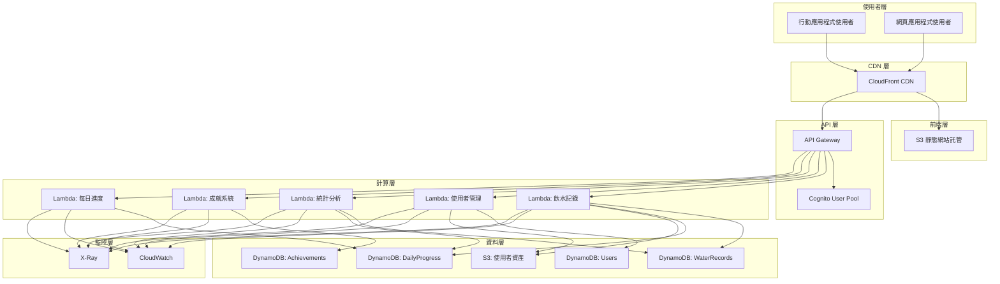
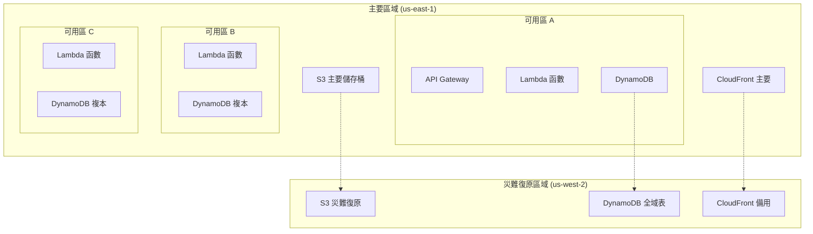
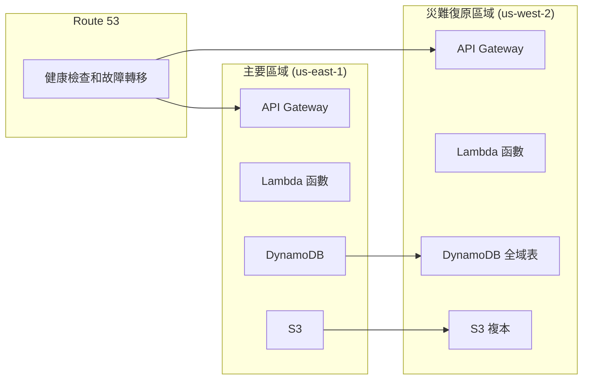

# FillUp! AWS 雲端基礎架構設計文件

## 概述

本文件詳細描述了 FillUp! 遊戲化飲水追蹤應用程式的 AWS 雲端基礎架構設計。該架構採用無伺服器優先的方法，利用 AWS 託管服務來實現高可用性、可擴展性和成本效益，同時遵循 AWS Well-Architected Framework 的五大支柱。

### 設計目標
- 支援 100 萬並發使用者
- 達到 99.9% 可用性 (8.76 小時/年停機時間)
- API 回應時間 < 200ms (P95)
- 自動擴展以應對流量波動
- 成本最佳化的資源配置
- 全面的安全性和合規性

## 架構

### 高階架構圖



### 區域架構



## 元件和介面

### 前端層

#### CloudFront CDN
- **目的**: 全球內容傳遞和快取
- **配置**:
  - 全球邊緣位置 (200+ 個位置)
  - 自訂網域名稱支援
  - SSL/TLS 憑證 (AWS Certificate Manager)
  - 安全標頭注入
  - 壓縮啟用 (Gzip, Brotli)
- **快取策略**:
  - 靜態資產: 1 年 TTL
  - API 回應: 無快取
  - 圖片資產: 30 天 TTL

#### S3 靜態網站託管
- **目的**: 託管 React/Vue 單頁應用程式
- **配置**:
  - 靜態網站託管啟用
  - 版本控制啟用
  - 伺服器端加密 (SSE-S3)
  - 公開讀取存取 (透過 CloudFront)
  - 生命週期政策 (舊版本 30 天後刪除)

### API 層

#### API Gateway
- **類型**: REST API
- **端點設計**:
  ```
  POST   /api/v1/water-records     - 新增飲水記錄
  GET    /api/v1/water-records     - 查詢飲水記錄
  GET    /api/v1/daily-progress    - 取得每日進度
  PUT    /api/v1/user/goal         - 更新目標設定
  GET    /api/v1/achievements      - 取得成就列表
  GET    /api/v1/statistics        - 取得統計資料
  POST   /api/v1/user/avatar       - 上傳使用者頭像
  ```
- **功能**:
  - 請求驗證 (JSON Schema)
  - 速率限制 (每使用者 10,000 req/sec)
  - CORS 配置
  - 請求/回應轉換
  - 快取配置 (選擇性端點)

#### Cognito User Pool
- **功能**:
  - 使用者註冊/登入
  - 密碼政策強制執行
  - MFA 支援 (選用)
  - 社交登入整合 (Google, Apple)
  - JWT 權杖發行
- **配置**:
  - 密碼最小長度: 8 字元
  - 需要大小寫字母和數字
  - 帳戶鎖定: 5 次失敗嘗試後鎖定 15 分鐘
  - 權杖有效期: Access Token 1 小時, Refresh Token 30 天

### 計算層

#### Lambda 函數架構

每個 Lambda 函數遵循單一職責原則：

##### 1. 飲水記錄服務 (water-records-service)
- **職責**: 處理飲水記錄的 CRUD 操作
- **記憶體**: 512 MB
- **逾時**: 30 秒
- **並發**: 預配置並發 100 (生產環境)
- **環境變數**: 
  - `WATER_RECORDS_TABLE_NAME`
  - `DAILY_PROGRESS_TABLE_NAME`

##### 2. 使用者管理服務 (user-management-service)
- **職責**: 使用者設定檔和目標管理
- **記憶體**: 256 MB
- **逾時**: 15 秒
- **環境變數**:
  - `USERS_TABLE_NAME`
  - `USER_ASSETS_BUCKET_NAME`

##### 3. 統計分析服務 (statistics-service)
- **職責**: 產生使用者統計和趨勢分析
- **記憶體**: 1024 MB
- **逾時**: 60 秒
- **環境變數**:
  - `WATER_RECORDS_TABLE_NAME`
  - `DAILY_PROGRESS_TABLE_NAME`

##### 4. 成就系統服務 (achievements-service)
- **職責**: 管理使用者成就和徽章
- **記憶體**: 512 MB
- **逾時**: 30 秒
- **環境變數**:
  - `ACHIEVEMENTS_TABLE_NAME`
  - `USERS_TABLE_NAME`

##### 5. 每日進度服務 (daily-progress-service)
- **職責**: 計算和更新每日進度
- **記憶體**: 256 MB
- **逾時**: 15 秒
- **環境變數**:
  - `DAILY_PROGRESS_TABLE_NAME`
  - `WATER_RECORDS_TABLE_NAME`

## 資料模型

### DynamoDB 資料表設計

#### 1. Users 資料表
```json
{
  "TableName": "fillup-users-{env}",
  "KeySchema": [
    {
      "AttributeName": "userId",
      "KeyType": "HASH"
    }
  ],
  "AttributeDefinitions": [
    {
      "AttributeName": "userId",
      "AttributeType": "S"
    },
    {
      "AttributeName": "email",
      "AttributeType": "S"
    }
  ],
  "GlobalSecondaryIndexes": [
    {
      "IndexName": "EmailIndex",
      "KeySchema": [
        {
          "AttributeName": "email",
          "KeyType": "HASH"
        }
      ]
    }
  ],
  "BillingMode": "ON_DEMAND"
}
```

**範例記錄**:
```json
{
  "userId": "user_123456",
  "email": "user@example.com",
  "displayName": "張小明",
  "dailyGoal": 2100,
  "timezone": "Asia/Taipei",
  "avatarUrl": "https://cdn.fillup.app/avatars/user_123456.jpg",
  "createdAt": "2024-01-15T08:00:00Z",
  "updatedAt": "2024-01-20T10:30:00Z",
  "preferences": {
    "reminderEnabled": true,
    "reminderInterval": 60,
    "workingHours": {
      "start": "09:00",
      "end": "18:00"
    }
  }
}
```

#### 2. WaterRecords 資料表
```json
{
  "TableName": "fillup-water-records-{env}",
  "KeySchema": [
    {
      "AttributeName": "userId",
      "KeyType": "HASH"
    },
    {
      "AttributeName": "timestamp",
      "KeyType": "RANGE"
    }
  ],
  "AttributeDefinitions": [
    {
      "AttributeName": "userId",
      "AttributeType": "S"
    },
    {
      "AttributeName": "timestamp",
      "AttributeType": "S"
    },
    {
      "AttributeName": "date",
      "AttributeType": "S"
    }
  ],
  "GlobalSecondaryIndexes": [
    {
      "IndexName": "DateIndex",
      "KeySchema": [
        {
          "AttributeName": "userId",
          "KeyType": "HASH"
        },
        {
          "AttributeName": "date",
          "KeyType": "RANGE"
        }
      ]
    }
  ],
  "BillingMode": "ON_DEMAND"
}
```

**範例記錄**:
```json
{
  "userId": "user_123456",
  "timestamp": "2024-01-20T10:30:00Z",
  "date": "2024-01-20",
  "amount": 250,
  "unit": "ml",
  "source": "mobile_app",
  "location": {
    "latitude": 25.0330,
    "longitude": 121.5654
  }
}
```

#### 3. DailyProgress 資料表
```json
{
  "TableName": "fillup-daily-progress-{env}",
  "KeySchema": [
    {
      "AttributeName": "userIdDate",
      "KeyType": "HASH"
    }
  ],
  "AttributeDefinitions": [
    {
      "AttributeName": "userIdDate",
      "AttributeType": "S"
    },
    {
      "AttributeName": "userId",
      "AttributeType": "S"
    },
    {
      "AttributeName": "date",
      "AttributeType": "S"
    }
  ],
  "GlobalSecondaryIndexes": [
    {
      "IndexName": "UserDateIndex",
      "KeySchema": [
        {
          "AttributeName": "userId",
          "KeyType": "HASH"
        },
        {
          "AttributeName": "date",
          "KeyType": "RANGE"
        }
      ]
    }
  ],
  "BillingMode": "ON_DEMAND"
}
```

**範例記錄**:
```json
{
  "userIdDate": "user_123456#2024-01-20",
  "userId": "user_123456",
  "date": "2024-01-20",
  "totalAmount": 1850,
  "goalAmount": 2100,
  "completionPercentage": 88.1,
  "recordCount": 7,
  "lastUpdated": "2024-01-20T16:45:00Z",
  "isGoalAchieved": false,
  "hourlyBreakdown": {
    "09": 250,
    "11": 350,
    "13": 500,
    "15": 250,
    "16": 500
  }
}
```

#### 4. Achievements 資料表
```json
{
  "TableName": "fillup-achievements-{env}",
  "KeySchema": [
    {
      "AttributeName": "userId",
      "KeyType": "HASH"
    },
    {
      "AttributeName": "achievementId",
      "KeyType": "RANGE"
    }
  ],
  "AttributeDefinitions": [
    {
      "AttributeName": "userId",
      "AttributeType": "S"
    },
    {
      "AttributeName": "achievementId",
      "AttributeType": "S"
    },
    {
      "AttributeName": "achievedDate",
      "AttributeType": "S"
    }
  ],
  "GlobalSecondaryIndexes": [
    {
      "IndexName": "AchievedDateIndex",
      "KeySchema": [
        {
          "AttributeName": "userId",
          "KeyType": "HASH"
        },
        {
          "AttributeName": "achievedDate",
          "KeyType": "RANGE"
        }
      ]
    }
  ],
  "BillingMode": "ON_DEMAND"
}
```

**範例記錄**:
```json
{
  "userId": "user_123456",
  "achievementId": "first_goal_achieved",
  "achievementType": "milestone",
  "title": "首次達標",
  "description": "完成第一次每日飲水目標",
  "badgeUrl": "https://cdn.fillup.app/badges/first_goal.png",
  "achievedDate": "2024-01-15",
  "achievedAt": "2024-01-15T20:30:00Z",
  "points": 100
}
```

## 錯誤處理

### 錯誤分類和處理策略

#### 1. 客戶端錯誤 (4xx)
- **400 Bad Request**: 請求格式錯誤
  - 回應: 詳細的驗證錯誤訊息
  - 日誌: WARN 級別
- **401 Unauthorized**: 認證失敗
  - 回應: 標準認證錯誤訊息
  - 日誌: INFO 級別
- **403 Forbidden**: 授權失敗
  - 回應: 權限不足訊息
  - 日誌: WARN 級別
- **404 Not Found**: 資源不存在
  - 回應: 資源未找到訊息
  - 日誌: INFO 級別
- **429 Too Many Requests**: 速率限制
  - 回應: 重試建議和時間
  - 日誌: WARN 級別

#### 2. 伺服器錯誤 (5xx)
- **500 Internal Server Error**: 未預期的伺服器錯誤
  - 回應: 通用錯誤訊息
  - 日誌: ERROR 級別，包含完整堆疊追蹤
- **502 Bad Gateway**: 上游服務錯誤
  - 回應: 服務暫時不可用
  - 日誌: ERROR 級別
- **503 Service Unavailable**: 服務過載
  - 回應: 重試建議
  - 日誌: ERROR 級別

### 錯誤回應格式
```json
{
  "error": {
    "code": "VALIDATION_ERROR",
    "message": "請求資料驗證失敗",
    "details": [
      {
        "field": "amount",
        "message": "飲水量必須大於 0"
      }
    ],
    "requestId": "req_123456789",
    "timestamp": "2024-01-20T10:30:00Z"
  }
}
```

### 重試機制
- **指數退避**: 初始延遲 100ms，最大延遲 30 秒
- **最大重試次數**: 3 次
- **可重試錯誤**: 5xx 錯誤、網路逾時、DynamoDB 節流

## 測試策略

### 測試金字塔

#### 1. 單元測試 (70%)
- **範圍**: 個別 Lambda 函數邏輯
- **工具**: Jest, TypeScript
- **覆蓋率目標**: > 90%
- **測試內容**:
  - 業務邏輯驗證
  - 資料轉換
  - 錯誤處理
  - 邊界條件

#### 2. 整合測試 (20%)
- **範圍**: Lambda 函數與 AWS 服務整合
- **工具**: Jest, AWS SDK Mock
- **測試內容**:
  - DynamoDB 操作
  - S3 檔案操作
  - Cognito 認證流程
  - API Gateway 整合

#### 3. 端到端測試 (10%)
- **範圍**: 完整使用者流程
- **工具**: Playwright, Postman
- **測試內容**:
  - 使用者註冊和登入
  - 飲水記錄建立和查詢
  - 統計資料產生
  - 成就系統觸發

### 效能測試
- **負載測試**: 模擬正常使用者負載
- **壓力測試**: 測試系統極限
- **尖峰測試**: 模擬突發流量
- **耐久性測試**: 長時間運行測試

### 安全測試
- **認證測試**: JWT 權杖驗證
- **授權測試**: API 存取控制
- **輸入驗證測試**: SQL 注入、XSS 防護
- **加密測試**: 資料傳輸和儲存加密## 
安全性設計

### 認證和授權

#### Cognito User Pool 配置
```json
{
  "UserPool": {
    "Policies": {
      "PasswordPolicy": {
        "MinimumLength": 8,
        "RequireUppercase": true,
        "RequireLowercase": true,
        "RequireNumbers": true,
        "RequireSymbols": false
      }
    },
    "AccountRecoverySetting": {
      "RecoveryMechanisms": [
        {
          "Name": "verified_email",
          "Priority": 1
        }
      ]
    },
    "MfaConfiguration": "OPTIONAL",
    "DeviceConfiguration": {
      "ChallengeRequiredOnNewDevice": true,
      "DeviceOnlyRememberedOnUserPrompt": false
    }
  }
}
```

#### IAM 角色和政策

##### Lambda 執行角色範例
```json
{
  "Version": "2012-10-17",
  "Statement": [
    {
      "Effect": "Allow",
      "Action": [
        "logs:CreateLogGroup",
        "logs:CreateLogStream",
        "logs:PutLogEvents"
      ],
      "Resource": "arn:aws:logs:*:*:*"
    },
    {
      "Effect": "Allow",
      "Action": [
        "dynamodb:GetItem",
        "dynamodb:PutItem",
        "dynamodb:UpdateItem",
        "dynamodb:DeleteItem",
        "dynamodb:Query"
      ],
      "Resource": [
        "arn:aws:dynamodb:*:*:table/fillup-water-records-*",
        "arn:aws:dynamodb:*:*:table/fillup-water-records-*/index/*"
      ]
    },
    {
      "Effect": "Allow",
      "Action": [
        "xray:PutTraceSegments",
        "xray:PutTelemetryRecords"
      ],
      "Resource": "*"
    }
  ]
}
```

### 網路安全

#### API Gateway 安全配置
- **HTTPS 強制執行**: 所有端點僅支援 HTTPS
- **CORS 配置**: 限制允許的來源網域
- **請求驗證**: JSON Schema 驗證
- **速率限制**: 每 IP 每秒最多 100 個請求
- **WAF 整合**: 防護常見攻擊模式

#### CloudFront 安全標頭
```json
{
  "ResponseHeadersPolicy": {
    "SecurityHeadersConfig": {
      "StrictTransportSecurity": {
        "AccessControlMaxAgeSec": 31536000,
        "IncludeSubdomains": true
      },
      "ContentTypeOptions": {
        "Override": true
      },
      "FrameOptions": {
        "FrameOption": "DENY",
        "Override": true
      },
      "ReferrerPolicy": {
        "ReferrerPolicy": "strict-origin-when-cross-origin",
        "Override": true
      }
    }
  }
}
```

### 資料加密

#### 靜態加密
- **DynamoDB**: 使用 AWS KMS 客戶管理金鑰
- **S3**: SSE-S3 加密，敏感資料使用 SSE-KMS
- **CloudWatch Logs**: 使用 KMS 加密

#### 傳輸中加密
- **API Gateway**: TLS 1.2+
- **CloudFront**: TLS 1.2+
- **內部服務通訊**: AWS 服務間自動加密

## 效能最佳化

### 快取策略

#### CloudFront 快取配置
```json
{
  "CacheBehaviors": [
    {
      "PathPattern": "/static/*",
      "CachePolicyId": "static-assets-policy",
      "TTL": {
        "DefaultTTL": 86400,
        "MaxTTL": 31536000
      }
    },
    {
      "PathPattern": "/api/v1/statistics",
      "CachePolicyId": "api-cache-policy",
      "TTL": {
        "DefaultTTL": 300,
        "MaxTTL": 3600
      }
    }
  ]
}
```

#### DynamoDB 效能最佳化
- **分割鍵設計**: 均勻分佈資料
- **全域次要索引**: 最佳化查詢模式
- **DynamoDB Accelerator (DAX)**: 微秒級快取 (生產環境)
- **批次操作**: 減少 API 呼叫次數

#### Lambda 效能最佳化
- **記憶體配置**: 根據 CPU 需求調整
- **預配置並發**: 消除冷啟動
- **連線重用**: 資料庫連線池
- **程式碼最佳化**: 最小化套件大小

### 監控和警報

#### CloudWatch 指標
```json
{
  "CustomMetrics": [
    {
      "MetricName": "WaterRecordCreated",
      "Namespace": "FillUp/Application",
      "Dimensions": [
        {
          "Name": "Environment",
          "Value": "${Environment}"
        }
      ]
    },
    {
      "MetricName": "DailyGoalAchieved",
      "Namespace": "FillUp/Application"
    },
    {
      "MetricName": "UserEngagement",
      "Namespace": "FillUp/Application"
    }
  ]
}
```

#### CloudWatch 警報配置
```json
{
  "Alarms": [
    {
      "AlarmName": "HighErrorRate",
      "MetricName": "Errors",
      "Namespace": "AWS/Lambda",
      "Statistic": "Sum",
      "Period": 300,
      "EvaluationPeriods": 2,
      "Threshold": 10,
      "ComparisonOperator": "GreaterThanThreshold"
    },
    {
      "AlarmName": "HighLatency",
      "MetricName": "Duration",
      "Namespace": "AWS/Lambda",
      "Statistic": "Average",
      "Period": 300,
      "EvaluationPeriods": 2,
      "Threshold": 5000,
      "ComparisonOperator": "GreaterThanThreshold"
    }
  ]
}
```

#### X-Ray 分散式追蹤
- **追蹤所有 Lambda 函數**
- **API Gateway 整合**
- **DynamoDB 操作追蹤**
- **效能瓶頸識別**

## 災難復原和備份

### 備份策略

#### DynamoDB 備份
- **時間點復原**: 35 天保留期
- **每日自動備份**: 保留 30 天
- **跨區域複製**: 全域表設定

#### S3 備份
- **版本控制**: 啟用所有儲存桶
- **跨區域複製**: 關鍵資產複製到災難復原區域
- **生命週期管理**: 舊版本自動歸檔

### 災難復原計畫

#### RTO/RPO 目標
- **復原時間目標 (RTO)**: 4 小時
- **復原點目標 (RPO)**: 1 小時
- **資料遺失容忍度**: 最多 1 小時的交易

#### 多區域部署


## 成本最佳化

### 成本估算 (每月)

#### 1,000 使用者場景
- **API Gateway**: $3.50 (1M 請求)
- **Lambda**: $8.40 (2M 請求, 平均 512MB, 200ms)
- **DynamoDB**: $12.50 (25 RCU, 25 WCU)
- **S3**: $2.30 (100GB 儲存, 10GB 傳輸)
- **CloudFront**: $8.50 (100GB 傳輸)
- **Cognito**: $5.50 (1,000 MAU)
- **CloudWatch**: $3.00 (日誌和指標)
- **總計**: ~$43.70/月

#### 10,000 使用者場景
- **API Gateway**: $35.00 (10M 請求)
- **Lambda**: $84.00 (20M 請求)
- **DynamoDB**: $125.00 (250 RCU, 250 WCU)
- **S3**: $23.00 (1TB 儲存, 100GB 傳輸)
- **CloudFront**: $85.00 (1TB 傳輸)
- **Cognito**: $55.00 (10,000 MAU)
- **CloudWatch**: $15.00
- **總計**: ~$422.00/月

#### 100,000 使用者場景
- **API Gateway**: $350.00 (100M 請求)
- **Lambda**: $840.00 (200M 請求)
- **DynamoDB**: $1,250.00 (2,500 RCU, 2,500 WCU)
- **S3**: $230.00 (10TB 儲存, 1TB 傳輸)
- **CloudFront**: $850.00 (10TB 傳輸)
- **Cognito**: $550.00 (100,000 MAU)
- **CloudWatch**: $75.00
- **總計**: ~$4,145.00/月

### 成本最佳化策略

#### 1. 資源調整
- **Lambda 記憶體最佳化**: 根據實際使用調整
- **DynamoDB 容量模式**: 根據流量模式選擇
- **S3 儲存類別**: 不常存取資料使用 IA 或 Glacier

#### 2. 預留容量
- **Lambda 預配置並發**: 穩定工作負載使用預留
- **DynamoDB 預留容量**: 可預測工作負載節省成本

#### 3. 生命週期管理
```json
{
  "S3LifecycleConfiguration": {
    "Rules": [
      {
        "Id": "UserAvatarLifecycle",
        "Status": "Enabled",
        "Transitions": [
          {
            "Days": 30,
            "StorageClass": "STANDARD_IA"
          },
          {
            "Days": 90,
            "StorageClass": "GLACIER"
          }
        ]
      }
    ]
  }
}
```

## 部署和 CI/CD

### GitHub Actions 工作流程

#### 基礎架構部署
```yaml
name: Deploy Infrastructure
on:
  push:
    branches: [main]
    paths: ['infrastructure/**']

jobs:
  deploy:
    runs-on: ubuntu-latest
    steps:
      - uses: actions/checkout@v3
      - uses: actions/setup-node@v3
        with:
          node-version: '18'
      
      - name: Install dependencies
        run: npm ci
        working-directory: infrastructure
      
      - name: Run tests
        run: npm test
        working-directory: infrastructure
      
      - name: Deploy to staging
        run: npx cdk deploy --all --require-approval never
        env:
          AWS_ACCESS_KEY_ID: ${{ secrets.AWS_ACCESS_KEY_ID }}
          AWS_SECRET_ACCESS_KEY: ${{ secrets.AWS_SECRET_ACCESS_KEY }}
          ENVIRONMENT: staging
      
      - name: Run integration tests
        run: npm run test:integration
        working-directory: infrastructure
      
      - name: Deploy to production
        if: github.ref == 'refs/heads/main'
        run: npx cdk deploy --all --require-approval never
        env:
          ENVIRONMENT: production
```

#### 應用程式部署
```yaml
name: Deploy Application
on:
  push:
    branches: [main]
    paths: ['src/**', 'frontend/**']

jobs:
  test:
    runs-on: ubuntu-latest
    steps:
      - uses: actions/checkout@v3
      - uses: actions/setup-node@v3
        with:
          node-version: '18'
      
      - name: Install dependencies
        run: npm ci
      
      - name: Run unit tests
        run: npm test -- --coverage --silent
      
      - name: Run linting
        run: npm run lint
      
      - name: Build application
        run: npm run build

  deploy-backend:
    needs: test
    runs-on: ubuntu-latest
    steps:
      - name: Deploy Lambda functions
        run: |
          for function in water-records user-management statistics achievements daily-progress; do
            aws lambda update-function-code \
              --function-name fillup-${function}-${ENVIRONMENT} \
              --zip-file fileb://dist/${function}.zip
          done

  deploy-frontend:
    needs: test
    runs-on: ubuntu-latest
    steps:
      - name: Build frontend
        run: npm run build
        working-directory: frontend
      
      - name: Deploy to S3
        run: |
          aws s3 sync frontend/dist/ s3://fillup-frontend-${ENVIRONMENT}/ --delete
          aws cloudfront create-invalidation --distribution-id ${CLOUDFRONT_DISTRIBUTION_ID} --paths "/*"
```

### 藍綠部署策略

#### Lambda 函數版本管理
```typescript
// CDK 程式碼範例
const lambdaFunction = new Function(this, 'WaterRecordsFunction', {
  // ... 函數配置
});

const version = lambdaFunction.currentVersion;
const alias = new Alias(this, 'WaterRecordsAlias', {
  aliasName: 'live',
  version: version,
});

// API Gateway 指向別名而非函數
const integration = new LambdaIntegration(alias);
```

#### 漸進式部署
- **階段 1**: 部署新版本到 10% 流量
- **階段 2**: 監控錯誤率和延遲 5 分鐘
- **階段 3**: 如果指標正常，增加到 50% 流量
- **階段 4**: 再次監控 5 分鐘
- **階段 5**: 完全切換到新版本

### 回滾機制
- **自動回滾**: 錯誤率 > 5% 或延遲 > 2 秒時自動觸發
- **手動回滾**: 透過 AWS CLI 或控制台快速切換
- **資料庫回滾**: 使用 DynamoDB 時間點復原
- **前端回滾**: CloudFront 快取失效和 S3 版本回復

## 合規性和治理

### 資料隱私
- **GDPR 合規**: 使用者資料刪除權和可攜權
- **資料最小化**: 僅收集必要的使用者資料
- **同意管理**: 明確的使用者同意機制
- **資料保留**: 自動刪除過期資料

### 稽核和日誌
- **CloudTrail**: 所有 API 呼叫記錄
- **VPC Flow Logs**: 網路流量監控
- **應用程式日誌**: 結構化 JSON 格式
- **存取日誌**: S3 和 CloudFront 存取記錄

### 標籤策略
```json
{
  "Tags": {
    "Project": "FillUp",
    "Environment": "production",
    "Owner": "platform-team",
    "CostCenter": "engineering",
    "Backup": "required",
    "Compliance": "gdpr"
  }
}
```

這個設計文件提供了完整的 AWS 雲端基礎架構藍圖，涵蓋了所有需求並遵循 AWS Well-Architected Framework 的最佳實務。架構設計支援高可用性、可擴展性和成本效益，同時確保安全性和合規性。