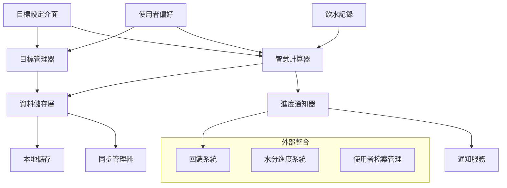

# 設計文件

## 概述

每日目標追蹤功能為 FillUp! 應用程式提供智慧化的飲水目標管理系統。此功能整合目標設定、進度計算、智慧建議和通知系統，讓使用者能夠有效管理和追蹤每日飲水目標，同時提供個人化的建議和及時的進度回饋。

## 架構

### 系統架構圖



### 資料流程

1. **目標設定流程**：使用者透過介面設定目標 → 目標管理器驗證並儲存 → 智慧計算器更新計算基準
2. **進度追蹤流程**：飲水記錄更新 → 智慧計算器重新計算進度 → 進度通知器檢查里程碑 → 觸發相應通知
3. **智慧建議流程**：智慧計算器分析使用者模式 → 產生建議 → 透過介面呈現給使用者

## 元件和介面

### 1. 目標管理器 (DailyGoalManager)

**職責**：管理每日飲水目標的設定、驗證和儲存

```typescript
interface DailyGoalManager {
  // 目標設定
  setDailyGoal(goalData: DailyGoalData): Promise<Result<DailyGoal, string>>;
  getDailyGoal(date: string): Promise<Result<DailyGoal, string>>;
  updateGoal(goalId: string, updates: Partial<DailyGoalData>): Promise<Result<DailyGoal, string>>;
  
  // 快速調整
  adjustGoal(goalId: string, adjustment: number): Promise<Result<DailyGoal, string>>;
  
  // 歷史管理
  getGoalHistory(startDate: string, endDate: string): Promise<Result<DailyGoal[], string>>;
  
  // 驗證
  validateGoalData(goalData: Partial<DailyGoalData>): ValidationResult;
}
```

### 2. 智慧計算器 (SmartCalculator)

**職責**：進度計算、節奏分析和智慧建議生成

```typescript
interface SmartCalculator {
  // 進度計算
  calculateProgress(goalId: string, waterRecords: WaterRecord[]): ProgressCalculation;
  calculatePace(goal: DailyGoal, currentProgress: number, currentTime: Date): PaceAnalysis;
  
  // 預測和建議
  estimateCompletionTime(goal: DailyGoal, currentProgress: number, currentTime: Date): Date | null;
  generateGoalSuggestions(userId: string, activityLevel?: ActivityLevel): GoalSuggestion[];
  
  // 模式分析
  analyzeUserPatterns(userId: string, days: number): UserPattern;
  detectActivityLevel(userId: string, date: string): ActivityLevel;
}
```

### 3. 進度通知器 (ProgressNotifier)

**職責**：監控進度里程碑並觸發相應通知

```typescript
interface ProgressNotifier {
  // 里程碑檢查
  checkMilestones(progress: ProgressCalculation): MilestoneEvent[];
  checkPaceWarnings(paceAnalysis: PaceAnalysis): PaceWarning[];
  
  // 通知觸發
  triggerMilestoneNotification(milestone: MilestoneEvent): Promise<void>;
  triggerPaceWarning(warning: PaceWarning): Promise<void>;
  triggerEncouragement(progress: ProgressCalculation): Promise<void>;
  
  // 通知管理
  scheduleReminders(goal: DailyGoal): Promise<void>;
  cancelReminders(goalId: string): Promise<void>;
}
```

### 4. 目標設定介面 (GoalSettingInterface)

**職責**：提供使用者友善的目標設定和調整介面

```typescript
interface GoalSettingInterface {
  // 介面渲染
  render(container: HTMLElement): void;
  
  // 目標設定
  showGoalSetup(currentGoal?: DailyGoal): void;
  showQuickAdjustment(currentGoal: DailyGoal): void;
  
  // 建議顯示
  displaySuggestions(suggestions: GoalSuggestion[]): void;
  
  // 事件處理
  onGoalChange: (goalData: DailyGoalData) => void;
  onQuickAdjust: (adjustment: number) => void;
  onSuggestionAccept: (suggestion: GoalSuggestion) => void;
}
```

## 資料模型

### 核心資料結構

```typescript
// 每日目標資料
interface DailyGoalData {
  targetVolume: number;           // 目標水量 (ml)
  activityPeriod: ActivityPeriod; // 活動時段
  activityLevel?: ActivityLevel;  // 活動量等級
  customNotes?: string;           // 自訂備註
}

// 每日目標
interface DailyGoal {
  goalId: string;
  userId: string;
  date: string;                   // YYYY-MM-DD
  goalData: DailyGoalData;
  createdAt: string;
  updatedAt: string;
  isActive: boolean;
}

// 進度計算結果
interface ProgressCalculation {
  goalId: string;
  currentVolume: number;
  targetVolume: number;
  completionPercentage: number;
  isGoalAchieved: boolean;
  remainingVolume: number;
  lastUpdated: string;
}

// 節奏分析
interface PaceAnalysis {
  expectedProgress: number;       // 預期進度百分比
  actualProgress: number;         // 實際進度百分比
  paceStatus: 'ahead' | 'on_track' | 'behind';
  deviationPercentage: number;    // 偏差百分比
  estimatedCompletion: Date | null;
}

// 活動量等級
type ActivityLevel = 'sedentary' | 'light' | 'moderate' | 'active' | 'very_active';

// 目標建議
interface GoalSuggestion {
  suggestionId: string;
  type: 'increase' | 'decrease' | 'maintain';
  suggestedVolume: number;
  reason: string;
  confidence: number;             // 0-1 信心度
  basedOn: string[];             // 建議依據
}

// 里程碑事件
interface MilestoneEvent {
  type: 'milestone_25' | 'milestone_50' | 'milestone_75' | 'milestone_100';
  percentage: number;
  achievedAt: Date;
  message: string;
}

// 節奏警告
interface PaceWarning {
  type: 'behind_schedule' | 'significantly_behind';
  severity: 'low' | 'medium' | 'high';
  message: string;
  suggestedAction: string;
}

// 使用者模式
interface UserPattern {
  averageGoal: number;
  goalVariability: number;
  achievementRate: number;
  preferredAdjustments: number[];
  peakHours: string[];
  consistencyScore: number;       // 0-1
}
```

### 儲存結構

```typescript
// 本地儲存鍵值結構
interface GoalStorageKeys {
  CURRENT_GOAL: `goal_current_${userId}`;
  GOAL_HISTORY: `goal_history_${userId}`;
  USER_PATTERNS: `goal_patterns_${userId}`;
  SUGGESTIONS_CACHE: `goal_suggestions_${userId}`;
  NOTIFICATION_SCHEDULE: `goal_notifications_${userId}`;
}
```

## 錯誤處理

### 錯誤類型定義

```typescript
enum GoalTrackingErrorCode {
  INVALID_GOAL_RANGE = 'INVALID_GOAL_RANGE',
  INVALID_TIME_PERIOD = 'INVALID_TIME_PERIOD',
  GOAL_NOT_FOUND = 'GOAL_NOT_FOUND',
  CALCULATION_ERROR = 'CALCULATION_ERROR',
  STORAGE_ERROR = 'STORAGE_ERROR',
  NOTIFICATION_ERROR = 'NOTIFICATION_ERROR'
}

interface GoalTrackingError {
  code: GoalTrackingErrorCode;
  message: string;
  details?: unknown;
  timestamp: string;
}
```

### 錯誤處理策略

1. **驗證錯誤**：即時回饋，阻止無效操作
2. **計算錯誤**：降級處理，使用預設值或快取資料
3. **儲存錯誤**：重試機制，本地快取備份
4. **通知錯誤**：靜默失敗，記錄日誌但不影響核心功能

## 測試策略

### 單元測試

1. **目標管理器測試**
   - 目標設定驗證
   - 快速調整邏輯
   - 歷史記錄管理

2. **智慧計算器測試**
   - 進度計算準確性
   - 節奏分析邏輯
   - 建議生成演算法

3. **進度通知器測試**
   - 里程碑檢測
   - 通知觸發時機
   - 提醒排程管理

### 整合測試

1. **端到端流程測試**
   - 目標設定到進度追蹤完整流程
   - 跨元件資料同步
   - 通知系統整合

2. **效能測試**
   - 大量資料處理效能
   - 記憶體使用最佳化
   - 響應時間要求

### 使用者體驗測試

1. **可用性測試**
   - 介面直觀性
   - 操作流暢度
   - 錯誤處理友善性

2. **無障礙測試**
   - 螢幕閱讀器相容性
   - 鍵盤導航支援
   - 色彩對比度檢查

## 效能考量

### 計算最佳化

1. **快取策略**
   - 進度計算結果快取
   - 建議演算法結果快取
   - 使用者模式分析快取

2. **批次處理**
   - 多筆記錄批次計算
   - 通知批次發送
   - 資料同步批次處理

### 記憶體管理

1. **資料清理**
   - 過期快取自動清理
   - 歷史資料分頁載入
   - 未使用物件及時釋放

2. **懶載入**
   - 歷史資料按需載入
   - 建議計算延遲執行
   - 通知排程動態載入

## 安全性

### 資料保護

1. **輸入驗證**
   - 目標數值範圍檢查
   - 時間格式驗證
   - SQL 注入防護

2. **資料加密**
   - 敏感資料本地加密
   - 傳輸過程 HTTPS 保護
   - 儲存權限控制

### 隱私保護

1. **資料最小化**
   - 只收集必要資料
   - 定期清理過期資料
   - 使用者資料匿名化

2. **同意管理**
   - 明確的資料使用說明
   - 使用者可控制的資料分享
   - 資料刪除權利保障

## 與現有系統整合

### 飲水記錄系統整合

```typescript
// 整合點：飲水記錄更新時觸發進度重新計算
interface WaterRecordIntegration {
  onWaterRecordAdded: (record: WaterRecord) => void;
  onWaterRecordUpdated: (record: WaterRecord) => void;
  onWaterRecordDeleted: (recordId: string) => void;
}
```

### 視覺化系統整合

```typescript
// 整合點：進度更新時同步視覺化元件
interface VisualizationIntegration {
  updateBucketProgress: (progress: ProgressCalculation) => void;
  triggerMilestoneAnimation: (milestone: MilestoneEvent) => void;
  showGoalAchievedCelebration: () => void;
}
```

### 回饋系統整合

```typescript
// 整合點：通知和回饋統一管理
interface FeedbackIntegration {
  showMilestoneNotification: (milestone: MilestoneEvent) => void;
  showPaceWarning: (warning: PaceWarning) => void;
  showGoalSuggestion: (suggestion: GoalSuggestion) => void;
}
```

### 使用者檔案系統整合

```typescript
// 整合點：使用者偏好和目標設定同步
interface UserProfileIntegration {
  syncDailyGoal: (goal: DailyGoal) => void;
  syncActivityPeriod: (period: ActivityPeriod) => void;
  syncReminderPreferences: (preferences: ReminderPreference) => void;
}
```

## 部署考量

### 漸進式部署

1. **階段一**：核心目標設定和進度計算
2. **階段二**：智慧建議和通知系統
3. **階段三**：進階分析和個人化功能

### 向後相容性

1. **資料遷移**：現有使用者檔案中的 dailyGoal 欄位自動遷移
2. **API 相容性**：保持現有介面不變，新增擴充功能
3. **降級支援**：新功能失效時回退到基本功能

### 監控和維護

1. **效能監控**：計算時間、記憶體使用、錯誤率
2. **使用者行為分析**：功能使用率、使用者滿意度
3. **系統健康檢查**：資料一致性、同步狀態、通知送達率