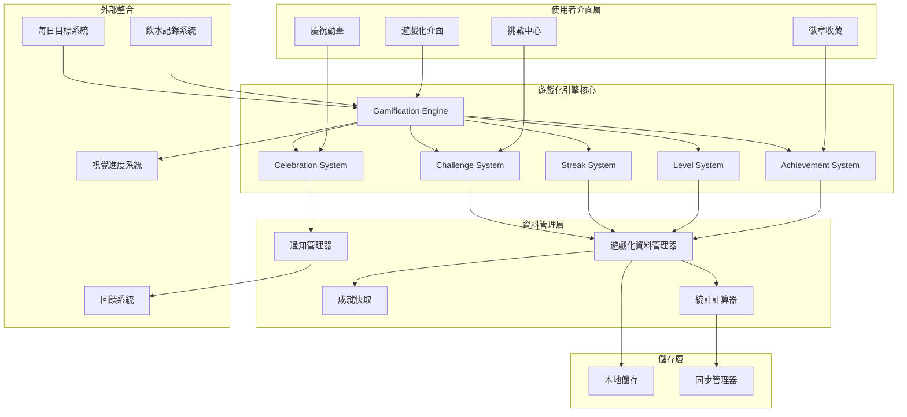

# 設計文件

## 概述

遊戲化激勵引擎是 FillUp! 的核心動機系統，透過成就徽章、經驗等級、連續紀錄、慶祝動畫和每日挑戰等機制，將日常飲水追蹤轉化為引人入勝的遊戲化體驗。系統設計遵循「有趣但不干擾」的原則，提供有意義且可持續的獎勵機制，增強使用者的長期參與度。

### 設計目標

1. **參與度提升**：透過多層次獎勵機制維持使用者長期動機
2. **非侵入性**：遊戲化元素增強而非干擾核心飲水追蹤功能
3. **個人化體驗**：根據使用者行為模式提供客製化挑戰和獎勵
4. **即時回饋**：提供即時的視覺和情感回饋強化正向行為
5. **社交分享**：支援成就分享增加社交動機

## 架構

### 系統架構圖



### 資料流程

1. **成就解鎖流程**：飲水記錄更新 → 統計計算 → 成就檢查 → 徽章頒發 → 慶祝動畫
2. **等級提升流程**：目標達成 → 經驗值獎勵 → 等級計算 → 升級檢查 → 特殊獎勵
3. **連續追蹤流程**：每日進度 → 連續檢查 → 紀錄更新 → 里程碑檢測 → 保護機制
4. **挑戰系統流程**：每日生成 → 進度監控 → 完成檢測 → 額外獎勵 → 統計更新
5. **慶祝系統流程**：成就觸發 → 動畫選擇 → 視覺呈現 → 分享生成 → 歷史記錄

## 元件和介面

### 1. 遊戲化引擎核心 (GamificationEngine)

**職責**：統籌所有遊戲化系統的協調和管理

```typescript
interface GamificationEngine {
  // 系統初始化
  initialize(userId: string): Promise<Result<GamificationState, string>>;
  
  // 事件處理
  onWaterRecordAdded(record: WaterRecord): Promise<void>;
  onDailyGoalCompleted(progress: DailyProgress): Promise<void>;
  onDayChanged(newDate: string): Promise<void>;
  
  // 狀態查詢
  getCurrentState(): GamificationState;
  getAchievementProgress(): AchievementProgress[];
  getChallengeStatus(): DailyChallenge | null;
  
  // 系統管理
  processScheduledEvents(): Promise<void>;
  syncData(): Promise<Result<void, string>>;
}

interface GamificationState {
  userId: string;
  level: number;
  experiencePoints: number;
  currentStreak: number;
  bestStreak: number;
  totalAchievements: number;
  activeChallenges: DailyChallenge[];
  lastUpdated: string;
}
```

### 2. 成就系統 (AchievementSystem)

**職責**：管理徽章定義、解鎖條件檢查和進度追蹤

```typescript
interface AchievementSystem {
  // 成就管理
  checkAchievements(userStats: UserStatistics): Promise<UnlockedAchievement[]>;
  getAchievementDefinitions(): AchievementDefinition[];
  getUserAchievements(userId: string): Promise<UserAchievement[]>;
  
  // 進度追蹤
  getAchievementProgress(userId: string): Promise<AchievementProgress[]>;
  updateProgress(userId: string, progressData: ProgressUpdate): Promise<void>;
  
  // 徽章管理
  unlockAchievement(userId: string, achievementId: string): Promise<Result<UserAchievement, string>>;
  getBadgeCollection(userId: string): Promise<BadgeCollection>;
}

// 成就定義
interface AchievementDefinition {
  achievementId: string;
  category: AchievementCategory;
  name: string;
  description: string;
  badgeIcon: string;
  rarity: 'common' | 'rare' | 'epic' | 'legendary';
  unlockCondition: UnlockCondition;
  experienceReward: number;
  isHidden: boolean; // 隱藏成就，解鎖前不顯示
}

type AchievementCategory = 
  | 'first_time'      // 首次達標類
  | 'streak'          // 連續紀錄類
  | 'consistency'     // 一致性類
  | 'volume'          // 水量里程碑類
  | 'challenge'       // 挑戰完成類
  | 'social'          // 社交分享類
  | 'special';        // 特殊事件類

// 解鎖條件
interface UnlockCondition {
  type: ConditionType;
  value: number;
  timeframe?: 'daily' | 'weekly' | 'monthly' | 'all_time';
  additionalCriteria?: Record<string, unknown>;
}

type ConditionType = 
  | 'goals_completed'
  | 'streak_days'
  | 'perfect_weeks'
  | 'total_volume'
  | 'challenges_completed'
  | 'shares_made'
  | 'consecutive_months';

// 成就進度
interface AchievementProgress {
  achievementId: string;
  currentValue: number;
  targetValue: number;
  progressPercentage: number;
  isUnlocked: boolean;
  unlockedAt?: string;
}
```

### 3. 等級系統 (LevelSystem)

**職責**：管理經驗值計算、等級進度和特殊稱號

```typescript
interface LevelSystem {
  // 經驗值管理
  awardExperience(userId: string, points: number, source: ExperienceSource): Promise<LevelResult>;
  getCurrentLevel(userId: string): Promise<UserLevel>;
  getExperienceHistory(userId: string, days?: number): Promise<ExperienceRecord[]>;
  
  // 等級計算
  calculateLevel(experiencePoints: number): number;
  getExperienceForLevel(level: number): number;
  getProgressToNextLevel(currentXP: number): LevelProgress;
  
  // 稱號系統
  checkTitleUnlocks(userId: string, newLevel: number): Promise<Title[]>;
  getUserTitles(userId: string): Promise<UserTitle[]>;
  setActiveTitle(userId: string, titleId: string): Promise<Result<void, string>>;
}

interface UserLevel {
  userId: string;
  level: number;
  experiencePoints: number;
  experienceToNext: number;
  progressPercentage: number;
  currentTitle?: Title;
  availableTitles: Title[];
}

interface LevelResult {
  previousLevel: number;
  newLevel: number;
  experienceGained: number;
  totalExperience: number;
  leveledUp: boolean;
  newTitles: Title[];
}

interface Title {
  titleId: string;
  name: string;
  description: string;
  unlockLevel: number;
  rarity: 'common' | 'rare' | 'epic' | 'legendary';
  icon?: string;
}

type ExperienceSource = 
  | 'daily_goal'
  | 'streak_bonus'
  | 'challenge_completion'
  | 'achievement_unlock'
  | 'perfect_week'
  | 'social_share';

// 經驗值獎勵表
const EXPERIENCE_REWARDS: Record<ExperienceSource, number> = {
  daily_goal: 10,
  streak_bonus: 5,
  challenge_completion: 15,
  achievement_unlock: 25,
  perfect_week: 50,
  social_share: 5
};
```

### 4. 連續紀錄系統 (StreakSystem)

**職責**：追蹤連續達標天數、管理保護機制和里程碑檢測

```typescript
interface StreakSystem {
  // 連續紀錄管理
  updateStreak(userId: string, date: string, goalAchieved: boolean): Promise<StreakResult>;
  getCurrentStreak(userId: string): Promise<StreakData>;
  getStreakHistory(userId: string, days?: number): Promise<StreakHistoryEntry[]>;
  
  // 保護機制
  useStreakProtection(userId: string): Promise<Result<StreakData, string>>;
  getStreakProtections(userId: string): Promise<StreakProtection[]>;
  earnStreakProtection(userId: string, source: ProtectionSource): Promise<void>;
  
  // 里程碑檢測
  checkStreakMilestones(streakData: StreakData): StreakMilestone[];
  getStreakMilestones(): StreakMilestoneDefinition[];
}

interface StreakData {
  userId: string;
  currentStreak: number;
  bestStreak: number;
  streakStartDate: string;
  lastUpdateDate: string;
  protectionsAvailable: number;
  totalProtectionsUsed: number;
  streakHistory: StreakHistoryEntry[];
}

interface StreakResult {
  previousStreak: number;
  newStreak: number;
  streakBroken: boolean;
  protectionUsed: boolean;
  milestonesReached: StreakMilestone[];
  experienceGained: number;
}

interface StreakProtection {
  protectionId: string;
  userId: string;
  source: ProtectionSource;
  earnedAt: string;
  usedAt?: string;
  isActive: boolean;
}

type ProtectionSource = 
  | 'achievement_reward'
  | 'challenge_completion'
  | 'level_milestone'
  | 'purchase'
  | 'special_event';

interface StreakMilestone {
  milestoneId: string;
  streakDays: number;
  name: string;
  description: string;
  experienceReward: number;
  achievementUnlocked?: string;
}
```

### 5. 挑戰系統 (ChallengeSystem)

**職責**：生成每日挑戰、監控完成進度和管理獎勵

```typescript
interface ChallengeSystem {
  // 挑戰管理
  generateDailyChallenge(userId: string, date: string): Promise<DailyChallenge>;
  getCurrentChallenge(userId: string): Promise<DailyChallenge | null>;
  getChallengeHistory(userId: string, days?: number): Promise<CompletedChallenge[]>;
  
  // 進度追蹤
  updateChallengeProgress(userId: string, challengeId: string, progress: ChallengeProgress): Promise<ChallengeResult>;
  checkChallengeCompletion(challenge: DailyChallenge, userStats: UserStatistics): boolean;
  
  // 挑戰類型管理
  getChallengeTemplates(): ChallengeTemplate[];
  getPersonalizedChallenges(userId: string): Promise<ChallengeTemplate[]>;
}

interface DailyChallenge {
  challengeId: string;
  userId: string;
  date: string;
  template: ChallengeTemplate;
  targetValue: number;
  currentProgress: number;
  isCompleted: boolean;
  completedAt?: string;
  experienceReward: number;
  createdAt: string;
}

interface ChallengeTemplate {
  templateId: string;
  name: string;
  description: string;
  type: ChallengeType;
  difficulty: 'easy' | 'medium' | 'hard';
  baseExperience: number;
  icon: string;
  validationRule: ChallengeValidation;
}

type ChallengeType = 
  | 'early_completion'    // 提前完成目標
  | 'time_based'         // 時間限制內完成
  | 'volume_bonus'       // 額外水量挑戰
  | 'frequency'          // 記錄頻率挑戰
  | 'consistency'        // 一致性挑戰
  | 'social';            // 社交互動挑戰

interface ChallengeValidation {
  type: ChallengeType;
  parameters: Record<string, unknown>;
  checkFunction: (progress: ChallengeProgress, userStats: UserStatistics) => boolean;
}

// 挑戰範例
const CHALLENGE_TEMPLATES: ChallengeTemplate[] = [
  {
    templateId: 'early_bird',
    name: '早鳥挑戰',
    description: '在中午 12:00 前喝 500ml 水',
    type: 'time_based',
    difficulty: 'easy',
    baseExperience: 15,
    icon: '🌅',
    validationRule: {
      type: 'time_based',
      parameters: { deadline: '12:00', volume: 500 },
      checkFunction: (progress, stats) => {
        return progress.completedBefore && 
               new Date(progress.completedBefore).getHours() < 12 &&
               progress.volumeAchieved >= 500;
      }
    }
  },
  {
    templateId: 'speed_demon',
    name: '閃電達標',
    description: '比平常提前 2 小時完成每日目標',
    type: 'early_completion',
    difficulty: 'medium',
    baseExperience: 20,
    icon: '⚡',
    validationRule: {
      type: 'early_completion',
      parameters: { hoursEarly: 2 },
      checkFunction: (progress, stats) => {
        const avgCompletionTime = stats.averageCompletionTime;
        const todayCompletion = new Date(progress.completedAt);
        const targetTime = new Date(avgCompletionTime);
        targetTime.setHours(targetTime.getHours() - 2);
        return todayCompletion <= targetTime;
      }
    }
  }
];
```

### 6. 慶祝系統 (CelebrationSystem)

**職責**：管理慶祝動畫、成就卡片生成和分享功能

```typescript
interface CelebrationSystem {
  // 慶祝動畫
  triggerCelebration(event: CelebrationEvent): Promise<void>;
  getCelebrationAnimation(eventType: CelebrationEventType): CelebrationAnimation;
  
  // 成就卡片
  generateAchievementCard(achievement: UserAchievement): Promise<AchievementCard>;
  generateMilestoneCard(milestone: StreakMilestone): Promise<AchievementCard>;
  generateLevelUpCard(levelResult: LevelResult): Promise<AchievementCard>;
  
  // 分享功能
  shareAchievement(card: AchievementCard, platform: SharePlatform): Promise<Result<void, string>>;
  getShareableLink(card: AchievementCard): Promise<string>;
  
  // 歷史回放
  getCelebrationHistory(userId: string): Promise<CelebrationHistoryEntry[]>;
  replayCelebration(celebrationId: string): Promise<void>;
}

interface CelebrationEvent {
  eventId: string;
  userId: string;
  type: CelebrationEventType;
  data: Record<string, unknown>;
  timestamp: string;
}

type CelebrationEventType = 
  | 'daily_goal_completed'
  | 'achievement_unlocked'
  | 'level_up'
  | 'streak_milestone'
  | 'challenge_completed'
  | 'perfect_week'
  | 'monthly_champion';

interface CelebrationAnimation {
  animationType: 'confetti' | 'fireworks' | 'sparkles' | 'water_splash';
  duration: number; // 毫秒
  colors: string[];
  intensity: 'low' | 'medium' | 'high';
  soundEffect?: string;
  customElements?: AnimationElement[];
}

interface AchievementCard {
  cardId: string;
  userId: string;
  type: 'achievement' | 'milestone' | 'level_up';
  title: string;
  description: string;
  imageUrl: string;
  backgroundColor: string;
  textColor: string;
  badgeIcon?: string;
  statistics: CardStatistic[];
  createdAt: string;
}

interface CardStatistic {
  label: string;
  value: string;
  icon?: string;
}

type SharePlatform = 'twitter' | 'facebook' | 'instagram' | 'line' | 'copy_link';
```

## 資料模型

### 遊戲化資料結構

```typescript
// 使用者遊戲化檔案
interface UserGamificationProfile {
  userId: string;
  level: number;
  experiencePoints: number;
  currentStreak: number;
  bestStreak: number;
  streakProtections: number;
  totalAchievements: number;
  activeTitleId?: string;
  preferences: GamificationPreferences;
  statistics: UserGamificationStatistics;
  createdAt: string;
  updatedAt: string;
}

// 遊戲化偏好設定
interface GamificationPreferences {
  celebrationAnimations: boolean;
  soundEffects: boolean;
  pushNotifications: boolean;
  achievementSharing: boolean;
  challengeParticipation: boolean;
  animationIntensity: 'low' | 'medium' | 'high';
}

// 使用者遊戲化統計
interface UserGamificationStatistics {
  totalGoalsCompleted: number;
  totalChallengesCompleted: number;
  totalExperienceEarned: number;
  averageStreakLength: number;
  longestStreakThisMonth: number;
  perfectWeeksCount: number;
  totalVolumeConsumed: number;
  achievementsByCategory: Record<AchievementCategory, number>;
  challengeCompletionRate: number;
  lastActiveDate: string;
}

// 經驗值記錄
interface ExperienceRecord {
  recordId: string;
  userId: string;
  source: ExperienceSource;
  points: number;
  description: string;
  relatedId?: string; // 相關成就、挑戰等的 ID
  timestamp: string;
}

// 挑戰進度
interface ChallengeProgress {
  challengeId: string;
  currentValue: number;
  targetValue: number;
  progressPercentage: number;
  completedAt?: string;
  completedBefore?: string; // 用於時間限制挑戰
  volumeAchieved?: number;  // 用於水量挑戰
  additionalData?: Record<string, unknown>;
}
```

### 儲存結構

```typescript
// 本地儲存鍵值結構
interface GamificationStorageKeys {
  USER_PROFILE: `gamification_profile_${userId}`;
  ACHIEVEMENTS: `gamification_achievements_${userId}`;
  EXPERIENCE_HISTORY: `gamification_experience_${userId}`;
  CHALLENGE_HISTORY: `gamification_challenges_${userId}`;
  CELEBRATION_HISTORY: `gamification_celebrations_${userId}`;
  STREAK_DATA: `gamification_streak_${userId}`;
  PREFERENCES: `gamification_preferences_${userId}`;
  STATISTICS: `gamification_statistics_${userId}`;
}

// 快取結構
interface GamificationCache {
  achievementDefinitions: Map<string, AchievementDefinition>;
  challengeTemplates: Map<string, ChallengeTemplate>;
  userProgress: Map<string, AchievementProgress[]>;
  activeAnimations: Set<string>;
  pendingCelebrations: CelebrationEvent[];
}
```

## 錯誤處理

### 錯誤類型定義

```typescript
enum GamificationErrorCode {
  ACHIEVEMENT_ALREADY_UNLOCKED = 'ACHIEVEMENT_ALREADY_UNLOCKED',
  INVALID_EXPERIENCE_SOURCE = 'INVALID_EXPERIENCE_SOURCE',
  STREAK_PROTECTION_UNAVAILABLE = 'STREAK_PROTECTION_UNAVAILABLE',
  CHALLENGE_NOT_FOUND = 'CHALLENGE_NOT_FOUND',
  ANIMATION_FAILED = 'ANIMATION_FAILED',
  SHARE_FAILED = 'SHARE_FAILED',
  DATA_SYNC_FAILED = 'DATA_SYNC_FAILED',
  INVALID_USER_STATE = 'INVALID_USER_STATE'
}

interface GamificationError {
  code: GamificationErrorCode;
  message: string;
  context?: Record<string, unknown>;
  timestamp: string;
  recoverable: boolean;
}
```

### 錯誤處理策略

1. **成就系統錯誤**
   - 重複解鎖：靜默忽略，記錄日誌
   - 條件檢查失敗：降級處理，使用快取資料
   - 資料不一致：觸發重新計算

2. **動畫系統錯誤**
   - 動畫載入失敗：使用預設動畫
   - 效能問題：降低動畫複雜度
   - 裝置不支援：回退到靜態慶祝

3. **資料同步錯誤**
   - 網路問題：本地快取，稍後重試
   - 伺服器錯誤：保持本地狀態，顯示離線模式
   - 資料衝突：使用最新時間戳記解決

## 測試策略

### 單元測試

1. **成就系統測試**
   - 解鎖條件邏輯驗證
   - 進度計算準確性
   - 重複解鎖防護

2. **等級系統測試**
   - 經驗值計算公式
   - 等級晉升邏輯
   - 稱號解鎖條件

3. **連續系統測試**
   - 連續天數計算
   - 保護機制觸發
   - 里程碑檢測

4. **挑戰系統測試**
   - 挑戰生成演算法
   - 完成條件驗證
   - 個人化推薦

### 整合測試

1. **跨系統協調測試**
   - 飲水記錄觸發遊戲化事件
   - 多系統同時更新的資料一致性
   - 慶祝動畫與其他 UI 元件的互動

2. **效能測試**
   - 大量成就檢查的效能
   - 動畫渲染效能
   - 記憶體使用最佳化

### 使用者體驗測試

1. **動機效果測試**
   - A/B 測試不同獎勵機制
   - 使用者參與度指標
   - 長期留存率分析

2. **可用性測試**
   - 慶祝動畫的適當性
   - 成就系統的理解度
   - 挑戰難度的平衡性

## 效能考量

### 計算最佳化

1. **成就檢查最佳化**
   - 增量檢查而非全量掃描
   - 條件預篩選減少計算量
   - 批次處理多個成就檢查

2. **動畫效能最佳化**
   - CSS 動畫優於 JavaScript 動畫
   - 使用 GPU 加速的 transform 屬性
   - 動畫結束後及時清理 DOM 元素

3. **資料快取策略**
   - 成就定義靜態快取
   - 使用者進度增量更新
   - 統計資料定期預計算

### 記憶體管理

1. **動畫資源管理**
   - 動畫素材懶載入
   - 播放完成後釋放資源
   - 限制同時播放的動畫數量

2. **資料結構最佳化**
   - 使用 Map 而非 Object 提升查找效能
   - 及時清理過期的快取資料
   - 分頁載入歷史記錄

## 安全性

### 資料完整性

1. **成就驗證**
   - 伺服器端重新驗證成就解鎖
   - 防止客戶端篡改成就資料
   - 異常行為檢測和標記

2. **經驗值保護**
   - 經驗值來源追蹤和驗證
   - 異常經驗值增長檢測
   - 定期資料一致性檢查

### 隱私保護

1. **分享控制**
   - 使用者可控制的分享範圍
   - 敏感資料自動過濾
   - 分享連結過期機制

2. **資料匿名化**
   - 統計資料去識別化
   - 排行榜可選匿名顯示
   - 使用者資料最小化收集

## 與現有系統整合

### 飲水記錄系統整合

```typescript
// 整合點：飲水記錄觸發遊戲化事件
interface WaterRecordIntegration {
  onWaterRecordAdded: (record: WaterRecord) => Promise<void>;
  onDailyGoalCompleted: (progress: DailyProgress) => Promise<void>;
  onWeeklyGoalCompleted: (weekData: WeeklyProgress) => Promise<void>;
}
```

### 視覺化系統整合

```typescript
// 整合點：慶祝動畫與視覺進度同步
interface VisualizationIntegration {
  triggerBucketCelebration: (milestone: number) => Promise<void>;
  showAchievementBadge: (achievement: UserAchievement) => Promise<void>;
  updateLevelIndicator: (level: number, progress: number) => Promise<void>;
}
```

### 通知系統整合

```typescript
// 整合點：遊戲化事件觸發通知
interface NotificationIntegration {
  sendAchievementNotification: (achievement: UserAchievement) => Promise<void>;
  sendLevelUpNotification: (levelResult: LevelResult) => Promise<void>;
  sendStreakMilestoneNotification: (milestone: StreakMilestone) => Promise<void>;
  sendChallengeReminder: (challenge: DailyChallenge) => Promise<void>;
}
```

## 部署考量

### 漸進式部署

1. **階段一**：基礎成就和等級系統
2. **階段二**：連續紀錄和慶祝動畫
3. **階段三**：每日挑戰和社交分享
4. **階段四**：進階個人化和 AI 推薦

### 功能開關

```typescript
interface GamificationFeatureFlags {
  achievementSystem: boolean;
  levelSystem: boolean;
  streakSystem: boolean;
  challengeSystem: boolean;
  celebrationAnimations: boolean;
  socialSharing: boolean;
  advancedAnalytics: boolean;
}
```

### 監控指標

1. **參與度指標**
   - 每日活躍使用者數
   - 成就解鎖率
   - 挑戰完成率
   - 分享互動率

2. **效能指標**
   - 動畫載入時間
   - 成就檢查延遲
   - 記憶體使用量
   - 錯誤發生率

3. **業務指標**
   - 使用者留存率提升
   - 每日目標完成率提升
   - 應用程式使用時長增加
   - 使用者滿意度評分