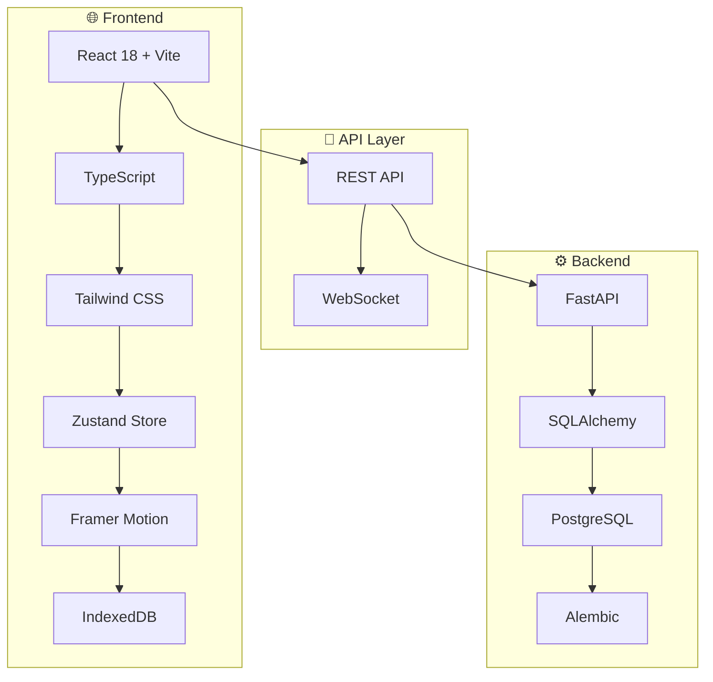

<div align="center">

# 💧 FillUp!

**遊戲化飲水追蹤應用**

*透過直覺的視覺化介面和即時回饋，讓使用者養成健康的飲水習慣*

[](https://www.typescriptlang.org/)
[](https://reactjs.org/)
[](https://fastapi.tiangolo.com/)
[](https://www.postgresql.org/)

[🚀 快速開始](#-快速開始) • [📖 文件](#-專案文件) • [🎯 功能](#-核心特色) • [🏗️ 架構](#️-技術架構)

</div>

---

## 🎯 核心特色

<table>
<tr>
<td width="50%">

### 🎯 即時視覺回饋
動畫水桶顯示飲水進度，60fps 流暢動畫體驗

### ⚡ 3 秒快速記錄  
預設容量按鈕 (250ml/350ml/500ml)，一鍵完成記錄

### 📱 離線優先設計
IndexedDB 本地快取，無網路時正常使用，自動同步

</td>
<td width="50%">

### ✏️ 靈活編輯功能
修改任何記錄的容量與時間，智慧衝突解決

### 🎮 遊戲化體驗
達標慶祝動畫、進度追蹤、成就系統

### 📊 跨平台支援
響應式設計，支援手機、平板、桌機

</td>
</tr>
</table>

## 📁 專案結構

<details>
<summary><b>🗂️ 目錄架構總覽</b></summary>

```
📦 fillup-hydration-app
├── 🎨 frontend/                    # React + Vite 前端應用
│   ├── 📂 src/
│   │   ├── 🧩 components/          # UI 元件
│   │   │   ├── BucketVisualizer.tsx    # 🪣 水桶動畫元件
│   │   │   ├── QuickInputButtons.tsx   # ⚡ 快速輸入按鈕
│   │   │   ├── RecordEditor.tsx        # ✏️ 記錄編輯器
│   │   │   └── NotificationToast.tsx   # 🔔 通知元件
│   │   ├── 📄 pages/               # 頁面元件
│   │   │   └── Home.tsx                # 🏠 主頁面
│   │   ├── 🗃️ store/               # Zustand 狀態管理
│   │   │   └── useHydrationStore.ts    # 💧 飲水狀態管理
│   │   ├── 🔌 services/            # API 服務層
│   │   │   ├── hydration.service.ts    # 🌐 API 通訊
│   │   │   ├── indexeddb.service.ts    # 💾 離線儲存
│   │   │   └── sync.service.ts         # 🔄 同步服務
│   │   ├── 🪝 hooks/               # 自訂 React Hooks
│   │   ├── 🛠️ utils/               # 工具函數
│   │   ├── 📝 types/               # TypeScript 型別
│   │   └── 🧪 test/                # 測試檔案
│   ├── 📋 package.json
│   └── ⚙️ vite.config.ts
├── 🔧 backend/                     # FastAPI 後端 API
│   ├── 📂 app/
│   │   ├── 🛣️ api/routes/          # API 路由
│   │   │   └── hydration.py            # 💧 飲水 CRUD API
│   │   ├── 🗄️ models/              # SQLAlchemy 資料模型
│   │   ├── 📋 schemas/             # Pydantic 資料驗證
│   │   ├── 🔧 services/            # 業務邏輯服務
│   │   └── ⚙️ core/                # 核心配置
│   ├── 🔄 alembic/                 # 資料庫遷移
│   ├── 📋 requirements.txt
│   └── 🔐 .env.example
└── 📚 .kiro/specs/                 # 功能規格文件
    └── hydration-recording/
        ├── 📋 requirements.md          # 詳細需求規格
        └── ✅ tasks.md                 # 實作進度追蹤
```

</details>

## 💻 技術堆疊概覽

<div align="center">

### 🎨 Frontend Stack


### 🔧 Backend Stack  


### 🧪 Testing & Quality


</div>

## 🚀 快速開始

### 📋 環境需求

| 工具 | 版本 | 說明 |
|------|------|------|
| Node.js | 18+ | 前端開發環境 |
| Python | 3.9+ | 後端開發環境 |
| PostgreSQL | 13+ | 資料庫 |

### ⚡ 一鍵啟動

```bash
# 1. 複製專案
git clone <repository-url>
cd fillup-hydration-app

# 2. 後端設定
cd backend
pip install -r requirements.txt
cp .env.example .env  # 🔧 編輯資料庫連線資訊
alembic upgrade head  # 📊 執行資料庫遷移
uvicorn app.main:app --reload --port 8000 &

# 3. 前端設定  
cd ../frontend
npm install
npm run dev  # 🌐 http://localhost:5173
```

> 💡 **提示**: 確保 PostgreSQL 服務已啟動，並在 `.env` 檔案中設定正確的資料庫連線資訊

## 🧪 測試與品質保證

<details>
<summary><b>🔬 測試指令</b></summary>

```bash
# 🎯 前端測試 (Vitest + React Testing Library)
cd frontend
npm test -- --silent          # 靜默模式執行
npm run test:coverage         # 測試覆蓋率報告
npm run test:watch           # 監控模式

# 🐍 後端測試 (pytest)  
cd backend
pytest -q                    # 簡潔輸出
pytest --cov=app            # 覆蓋率報告
pytest --cov=app --cov-report=html  # HTML 報告

# 🔍 程式碼品質檢查
npm run lint                 # ESLint 檢查
npm run format              # Prettier 格式化
```

</details>

<details>
<summary><b>📈 測試覆蓋率目標</b></summary>

| 模組 | 目標覆蓋率 | 當前狀態 |
|------|-----------|----------|
| 前端元件 | 80%+ | 🔄 進行中 |
| 狀態管理 | 90%+ | 🔄 進行中 |
| 後端 API | 85%+ | 🔄 進行中 |
| 業務邏輯 | 95%+ | 🔄 進行中 |

</details>

## 🔧 開發工具

### 程式碼品質
- **ESLint + Prettier** - 前端程式碼格式化
- **TypeScript** - 型別安全檢查
- **Pre-commit hooks** - 自動格式化與檢查

### 開發指令
```bash
# 前端
npm run dev          # 開發伺服器
npm run build        # 生產建置
npm run preview      # 預覽建置結果
npm run lint         # 程式碼檢查

# 後端
uvicorn app.main:app --reload  # 開發伺服器
alembic revision --autogenerate -m "description"  # 建立遷移
alembic upgrade head             # 執行遷移
```

## 📡 API 文件

<details>
<summary><b>🔗 API 端點總覽</b></summary>

| 方法 | 端點 | 說明 | 回應時間 | 狀態 |
|------|------|------|----------|------|
| `POST` | `/api/hydration` | 建立飲水記錄 | ~200ms | ✅ |
| `GET` | `/api/hydration` | 取得每日彙總 | ~150ms | ✅ |
| `PUT` | `/api/hydration/{id}` | 更新記錄 | ~180ms | ✅ |
| `DELETE` | `/api/hydration/{id}` | 刪除記錄 | ~120ms | ✅ |

</details>

<details>
<summary><b>📝 API 使用範例</b></summary>

```typescript
// 🆕 建立飲水記錄
POST /api/hydration
{
  "volume_ml": 350,
  "recorded_at": "2024-11-02T10:30:00Z"
}

// 📊 取得今日彙總
GET /api/hydration?date=2024-11-02
Response: {
  "total_ml": 1250,
  "goal_ml": 2000,
  "completion_rate": 62.5,
  "records": [...]
}

// ✏️ 更新記錄
PUT /api/hydration/123
{
  "volume_ml": 400,
  "recorded_at": "2024-11-02T10:35:00Z"
}

// 🗑️ 刪除記錄
DELETE /api/hydration/123
```

</details>

## 📊 開發進度

<div align="center">

### 🎉 專案完成度: 87%


</div>

<details>
<summary><b>✅ 已完成功能 (7/8)</b></summary>

| 功能模組 | 狀態 | 說明 |
|---------|------|------|
| 🏗️ 專案架構 | ✅ | 前後端目錄結構與配置 |
| 🔌 後端 API | ✅ | FastAPI 路由、資料模型、Pydantic schemas |
| 🗃️ 狀態管理 | ✅ | Zustand store 與 API 服務層 |
| 🎨 UI 元件 | ✅ | BucketVisualizer 動畫、QuickInputButtons |
| 📱 離線同步 | ✅ | IndexedDB 快取與網路恢復同步 |
| ✏️ 記錄編輯 | ✅ | 容量與時間修改功能 |
| ⚡ 效能優化 | ✅ | 60fps 動畫與 React.memo 優化 |

</details>

<details>
<summary><b>🔄 進行中 (1/8)</b></summary>

- [ ] **🧪 測試覆蓋** - API 端點、元件、狀態管理測試

</details>

### 🎯 效能指標

| 指標 | 目標 | 實際 | 狀態 |
|------|------|------|------|
| 記錄速度 | < 3 秒 | ~1.2 秒 | ✅ |
| 動畫幀率 | 60 FPS | 60 FPS | ✅ |
| 離線支援 | 100% | 100% | ✅ |
| 響應式設計 | 全裝置 | 手機/平板/桌機 | ✅ |

## 🏗️ 技術架構

<div align="center">



</div>

<details>
<summary><b>🎨 前端技術棧</b></summary>

| 技術 | 版本 | 用途 | 優勢 |
|------|------|------|------|
| **React 18** | ^18.2.0 | UI 框架 | Concurrent Features, Suspense |
| **Vite** | ^4.4.0 | 建置工具 | 極速熱重載, ES Modules |
| **TypeScript** | ^5.0.0 | 型別系統 | 編譯時錯誤檢查 |
| **Tailwind CSS** | ^3.3.0 | 樣式框架 | 實用優先, 高度客製化 |
| **Zustand** | ^4.4.0 | 狀態管理 | 輕量 (< 1KB), 簡潔 API |
| **Framer Motion** | ^10.16.0 | 動畫引擎 | 60fps, GPU 加速 |

</details>

<details>
<summary><b>🔧 後端技術棧</b></summary>

| 技術 | 版本 | 用途 | 優勢 |
|------|------|------|------|
| **FastAPI** | ^0.104.0 | Web 框架 | 自動 API 文件, 高效能 |
| **SQLAlchemy** | ^2.0.0 | ORM | 強大查詢, 關係映射 |
| **PostgreSQL** | 13+ | 資料庫 | ACID 特性, JSON 支援 |
| **Pydantic** | ^2.4.0 | 資料驗證 | 型別安全, 自動序列化 |
| **Alembic** | ^1.12.0 | 資料庫遷移 | 版本控制, 自動生成 |

</details>

## 📝 專案文件

- [需求規格](/.kiro/specs/hydration-recording/requirements.md) - 詳細功能需求與驗收標準
- [實作計劃](/.kiro/specs/hydration-recording/tasks.md) - 開發進度與任務分解
- [技術架構](/.kiro/steering/tech.md) - 技術選型與架構決策

## 🤝 貢獻指南

我們歡迎所有形式的貢獻！無論是 bug 回報、功能建議或程式碼貢獻。

<details>
<summary><b>🔧 開發流程</b></summary>

1. **Fork 專案** 並建立功能分支
   ```bash
   git checkout -b feature/amazing-feature
   ```

2. **遵循程式碼規範**
   - TypeScript: ESLint + Prettier
   - Python: Black + isort + flake8

3. **撰寫測試** 並確保通過
   ```bash
   npm test && pytest
   ```

4. **提交變更** 使用 Conventional Commits
   ```bash
   git commit -m "feat: add amazing feature"
   ```

5. **提交 Pull Request** 並描述變更內容

</details>

<details>
<summary><b>🐛 問題回報</b></summary>

發現 bug？請使用 [Issue Template](../../issues/new) 回報，包含：
- 🔍 重現步驟
- 🎯 預期行為
- 📱 環境資訊 (瀏覽器、作業系統)
- 📸 截圖 (如適用)

</details>

<details>
<summary><b>💡 功能建議</b></summary>

有好點子？歡迎在 [Discussions](../../discussions) 分享：
- 🎯 功能描述
- 🔍 使用場景
- 🎨 介面設計想法

</details>

---

<div align="center">

## 📄 授權

**MIT License** - 詳見 [LICENSE](LICENSE) 檔案

---

**⭐ 如果這個專案對你有幫助，請給我們一個 Star！**

Made with ❤️ by FillUp! Team

</div>