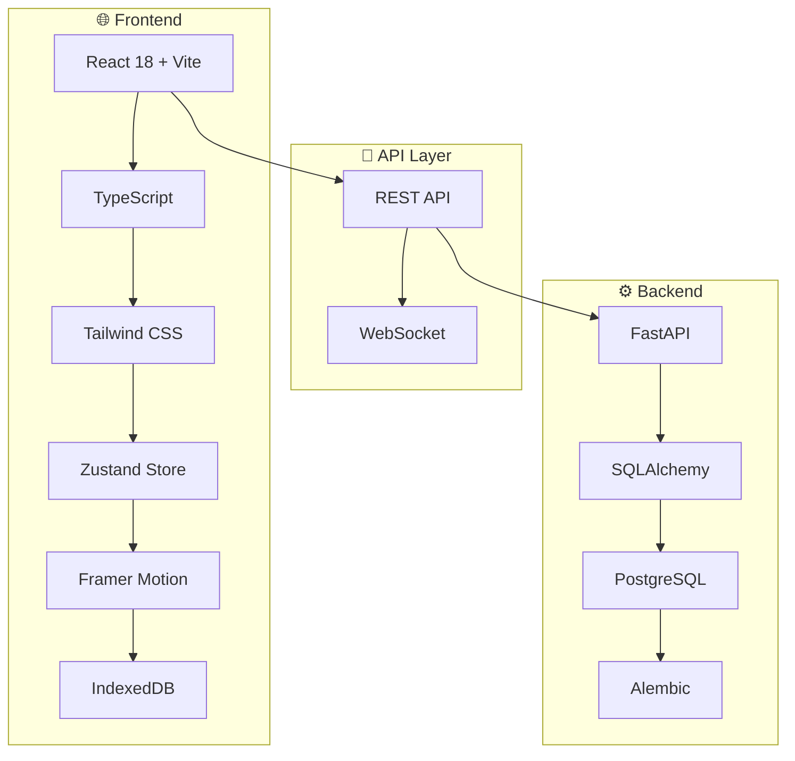

<div align="center">

# 💧 FillUp!

**遊戲化飲水追蹤應用**

*透過直覺的視覺化介面和即時回饋，讓使用者養成健康的飲水習慣*

[](https://www.typescriptlang.org/)
[](https://reactjs.org/)
[](https://fastapi.tiangolo.com/)
[](https://www.postgresql.org/)

[🚀 快速開始](#-快速開始) • [📖 文件](#-專案文件) • [🎯 功能](#-核心特色) • [🏗️ 架構](#️-技術架構)

</div>

---

## 🎯 核心特色

### 🎯 即時視覺回饋
動畫水桶顯示飲水進度，60fps 流暢動畫體驗

### ⚡ 3 秒快速記錄  
預設容量按鈕 (250ml/350ml/500ml)，一鍵完成記錄

### 📱 離線優先設計
IndexedDB 本地快取，無網路時正常使用，自動同步

### ✏️ 靈活編輯功能
修改任何記錄的容量與時間，智慧衝突解決

### 🎮 遊戲化體驗
達標慶祝動畫、進度追蹤、成就系統

### 📊 跨平台支援
響應式設計，支援手機、平板、桌機


## 📁 專案結構

<details>
<summary><b>🗂️ 目錄架構總覽</b></summary>

```
📦 fillup-hydration-app
├── 🎨 frontend/                    # React + Vite 前端應用
│   ├── 📂 src/
│   │   ├── 🧩 components/          # UI 元件
│   │   │   ├── BucketVisualizer.tsx    # 🪣 水桶動畫元件
│   │   │   ├── QuickInputButtons.tsx   # ⚡ 快速輸入按鈕
│   │   │   ├── RecordEditor.tsx        # ✏️ 記錄編輯器
│   │   │   └── NotificationToast.tsx   # 🔔 通知元件
│   │   ├── 📄 pages/               # 頁面元件
│   │   │   └── Home.tsx                # 🏠 主頁面
│   │   ├── 🗃️ store/               # Zustand 狀態管理
│   │   │   └── useHydrationStore.ts    # 💧 飲水狀態管理
│   │   ├── 🔌 services/            # API 服務層
│   │   │   ├── hydration.service.ts    # 🌐 API 通訊
│   │   │   ├── indexeddb.service.ts    # 💾 離線儲存
│   │   │   └── sync.service.ts         # 🔄 同步服務
│   │   ├── 🪝 hooks/               # 自訂 React Hooks
│   │   ├── 🛠️ utils/               # 工具函數
│   │   ├── 📝 types/               # TypeScript 型別
│   │   └── 🧪 test/                # 測試檔案
│   ├── 📋 package.json
│   └── ⚙️ vite.config.ts
├── 🔧 backend/                     # FastAPI 後端 API
│   ├── 📂 app/
│   │   ├── 🛣️ api/routes/          # API 路由
│   │   │   └── hydration.py            # 💧 飲水 CRUD API
│   │   ├── 🗄️ models/              # SQLAlchemy 資料模型
│   │   ├── 📋 schemas/             # Pydantic 資料驗證
│   │   ├── 🔧 services/            # 業務邏輯服務
│   │   └── ⚙️ core/                # 核心配置
│   ├── 🔄 alembic/                 # 資料庫遷移
│   ├── 📋 requirements.txt
│   └── 🔐 .env.example
└── 📚 .kiro/specs/                 # 功能規格文件
    └── hydration-recording/
        ├── 📋 requirements.md          # 詳細需求規格
        └── ✅ tasks.md                 # 實作進度追蹤
```

</details>

## 💻 技術堆疊概覽

<div align="center">

### 🎨 Frontend Stack


### 🔧 Backend Stack  


### 🧪 Testing & Quality


</div>

## 🚀 快速開始

### 📋 環境需求

| 工具 | 版本 | 說明 |
|------|------|------|
| Node.js | 18+ | 前端開發環境 |
| Python | 3.9+ | 後端開發環境 |
| PostgreSQL | 13+ | 資料庫 |

### ⚡ 一鍵啟動

```bash
# 1. 複製專案
git clone <repository-url>
cd fillup-hydration-app

# 2. 後端設定
cd backend
pip install -r requirements.txt
cp .env.example .env  # 🔧 編輯資料庫連線資訊
alembic upgrade head  # 📊 執行資料庫遷移
uvicorn app.main:app --reload --port 8000 &

# 3. 前端設定  
cd ../frontend
npm install
npm run dev  # 🌐 http://localhost:5173
```

> 💡 **提示**: 確保 PostgreSQL 服務已啟動，並在 `.env` 檔案中設定正確的資料庫連線資訊

## 🏗️ 技術架構

<div align="center">



</div>

<details>
<summary><b>🎨 前端技術棧</b></summary>

| 技術 | 版本 | 用途 | 優勢 |
|------|------|------|------|
| **React 18** | ^18.2.0 | UI 框架 | Concurrent Features, Suspense |
| **Vite** | ^4.4.0 | 建置工具 | 極速熱重載, ES Modules |
| **TypeScript** | ^5.0.0 | 型別系統 | 編譯時錯誤檢查 |
| **Tailwind CSS** | ^3.3.0 | 樣式框架 | 實用優先, 高度客製化 |
| **Zustand** | ^4.4.0 | 狀態管理 | 輕量 (< 1KB), 簡潔 API |
| **Framer Motion** | ^10.16.0 | 動畫引擎 | 60fps, GPU 加速 |

</details>

<details>
<summary><b>🔧 後端技術棧</b></summary>

| 技術 | 版本 | 用途 | 優勢 |
|------|------|------|------|
| **FastAPI** | ^0.104.0 | Web 框架 | 自動 API 文件, 高效能 |
| **SQLAlchemy** | ^2.0.0 | ORM | 強大查詢, 關係映射 |
| **PostgreSQL** | 13+ | 資料庫 | ACID 特性, JSON 支援 |
| **Pydantic** | ^2.4.0 | 資料驗證 | 型別安全, 自動序列化 |
| **Alembic** | ^1.12.0 | 資料庫遷移 | 版本控制, 自動生成 |

</details>

## 📝 專案文件

- [需求規格](/.kiro/specs/hydration-recording/requirements.md) - 詳細功能需求與驗收標準
- [技術架構](/.kiro/steering/tech.md) - 技術選型與架構決策
- [API 參考](#-api-參考) - 核心模組 API 文件

## 📚 API 參考

### 單位轉換模組 (`utils/units`)

提供毫升 (ml) 和液體盎司 (oz) 之間的雙向轉換功能。

#### 核心轉換函式

##### `mlToOz(ml: number): number`

將毫升轉換為液體盎司，結果四捨五入至小數點後 1 位。

```typescript
import { mlToOz } from '@/utils/units';

mlToOz(250);  // 8.5
mlToOz(500);  // 16.9
mlToOz(0);    // 0
mlToOz(-100); // 0 (負值視為無效)
```

##### `ozToMl(oz: number): number`

將液體盎司轉換為毫升，結果四捨五入至整數。

```typescript
import { ozToMl } from '@/utils/units';

ozToMl(8.5);  // 251
ozToMl(16.9); // 500
ozToMl(0);    // 0
ozToMl(-10);  // 0 (負值視為無效)
```

#### 格式化與解析

##### `formatVolume(value: number, unit: VolumeUnit): string`

格式化容量值為顯示字串。ml 顯示整數，oz 顯示小數點後 1 位。

```typescript
import { formatVolume } from '@/utils/units';

formatVolume(250, 'ml');    // "250"
formatVolume(250.7, 'ml');  // "251"
formatVolume(8.5, 'oz');    // "8.5"
formatVolume(-100, 'ml');   // "0"
```

##### `parseVolume(value: string, unit: VolumeUnit): number`

解析字串為容量數值，自動套用適當精度。

```typescript
import { parseVolume } from '@/utils/units';

parseVolume('250', 'ml');     // 250
parseVolume('250.7', 'ml');   // 251
parseVolume('8.45', 'oz');    // 8.5
parseVolume('abc', 'ml');     // 0 (無效輸入)
```

#### 輔助函式

##### `getCommonVolumes(unit?: VolumeUnit): number[]`

取得常用容量預設值陣列，用於快速輸入按鈕。

```typescript
import { getCommonVolumes } from '@/utils/units';

getCommonVolumes('ml');  // [250, 350, 500, 750, 1000]
getCommonVolumes('oz');  // [8.5, 11.8, 16.9, 25.4, 33.8]
```

##### `validateVolumeRange(volume: number, unit?: VolumeUnit): boolean`

驗證容量值是否在有效範圍內 (1ml - 5000ml)。

```typescript
import { validateVolumeRange } from '@/utils/units';

validateVolumeRange(250, 'ml');    // true
validateVolumeRange(8.5, 'oz');    // true
validateVolumeRange(0, 'ml');      // false
validateVolumeRange(6000, 'ml');   // false
```

##### `getVolumeUnitLabel(unit: VolumeUnit): string`

取得容量單位的中文標籤。

```typescript
import { getVolumeUnitLabel } from '@/utils/units';

getVolumeUnitLabel('ml');  // "毫升"
getVolumeUnitLabel('oz');  // "盎司"
```

#### 統一命名空間

```typescript
import { units } from '@/utils/units';

// 透過 units 物件存取所有函式
const oz = units.mlToOz(250);
const ml = units.ozToMl(8.5);
const display = units.formatVolume(250, 'ml');
const value = units.parseVolume('8.5', 'oz');
```

#### 型別定義

```typescript
type VolumeUnit = 'ml' | 'oz';
```

#### 轉換係數

- 1 oz = 29.5735 ml (US fluid ounce)
- 1 ml = 0.033814 oz

---

## 🤝 貢獻指南

我們歡迎所有形式的貢獻！無論是 bug 回報、功能建議或程式碼貢獻。

<details>
<summary><b>🔧 開發流程</b></summary>

1. **Fork 專案** 並建立功能分支
   ```bash
   git checkout -b feature/amazing-feature
   ```

2. **遵循程式碼規範**
   - TypeScript: ESLint + Prettier
   - Python: Black + isort + flake8

3. **撰寫測試** 並確保通過
   ```bash
   npm test && pytest
   ```

4. **提交變更** 使用 Conventional Commits
   ```bash
   git commit -m "feat: add amazing feature"
   ```

5. **提交 Pull Request** 並描述變更內容

</details>

<details>
<summary><b>🐛 問題回報</b></summary>

發現 bug？請使用 [Issue Template](https://github.com/estellacoding/fillup-web/issues) 回報，包含：
- 🔍 重現步驟
- 🎯 預期行為
- 📱 環境資訊 (瀏覽器、作業系統)
- 📸 截圖 (如適用)

</details>

<details>
<summary><b>💡 功能建議</b></summary>

有好點子？歡迎在 [Discussions](https://github.com/estellacoding/fillup-web/discussions) 分享：
- 🎯 功能描述
- 🔍 使用場景
- 🎨 介面設計想法

</details>

---

<div align="center">

## 📄 授權

**MIT License** - 詳見 [LICENSE](LICENSE) 檔案

---

**⭐ 如果這個專案對你有幫助，請給我一個 Star！**

Made with ❤️ by Stella

</div>